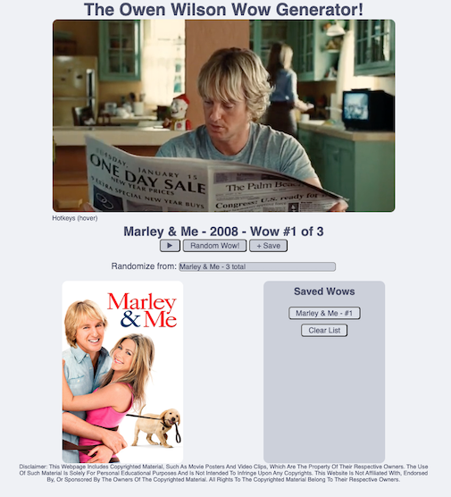
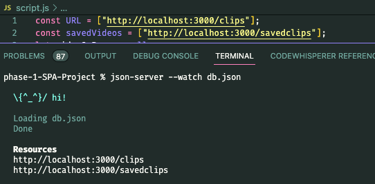
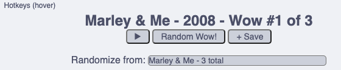
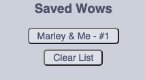

<a name="readme-top"></a>

[![LinkedIn][linkedin-shield]][linkedin-url]

<!-- PROJECT LOGO -->
<br />
<div align="center">
<p align="center">
    
</p>
<h2 align="center">The Owen Wilson Wow Generator</h2>

  <p align="center">
    A generator of randomized Owen Wilson "wow"s courtesy of the Owen Wilson Wow Api (by Avi Mamenko)
  </p>
<p>(Courtesy Wikipedia, Georges Biard - Creative Commons 3.0, slight crop made)</p>
  <p align="right">(<a href="#acknowledgments">See Acknowledgments</a>)</p>
    <br />
    <a href="https://youtube.com/">View Video Demo</a>
</div>


<!-- TABLE OF CONTENTS -->
<details>
  <summary>Table of Contents</summary>
  <ol>
    <li>
      <a href="#getting-started">Getting Started</a>
      <ul>
        <li><a href="#prerequisites">Prerequisites</a></li>
        <li><a href="#installation">Installation</a></li>
        <li><a href="#usage">Usage</a></li>
      </ul>
    </li>
    <li><a href="#license">License</a></li>
    <li><a href="#contact">Contact</a></li>
    <li><a href="#acknowledgments">Acknowledgments</a></li>
  </ol>
</details>


<!-- ABOUT THE PROJECT -->
## About The Project
<div align="center">

</div>
This is my Phase-1 Project for Flatiron School. In this project, I use a combination of JavaScript, HTML, and CSS to create a single page application. This application dynamically populates elements such as the video, poster, and the title information using JavaScript by interacting with a local json-server db.json file. JavaScript is also used to fetch data (GET, POST, DELETE) and provide functionality to the buttons and hotkeys found on the page.

***

<br><br>

## Getting Started

To get a local copy up and running follow these steps.

<br>

### Prerequisites

1. If you already have json-server, move to step 2, otherwise, please install [json-server](https://www.npmjs.com/package/json-server) by running the following command in your terminal.

* json-server installation
```sh
npm i json-server
```
2. Next, use the following command to start your local json-server with db.json as its database.
* json-server initialization
```sh
json-server --watch db.json
 ```

***

### Installation

1. Clone this repo to a folder on your computer using your method of choice, example using SSH:
(after navigating to the folder you want to clone to)
```sh
git clone git@github.com:AldenReyes/phase-1-SPA-Project-Owen-Wilson-Wow-Generator.git
```

2. Verify that your Resources URLs in json-server match up with the following URL's found at the top of script.js.



If they match you're good to go! If not, you'll need to replace them for the site to function.
```js
  const URL = "[http://*insert your local host:port here*/clips]"
  const savedVideos = "[http://*insert your local host:port here*/savedclips]"
```
3. You can now open index.html in your local browser and begin using the webpage!

***

### Usage



The button bar allows you to (from left to right) play a wow again, randomize from the collection of wows then load it to the page, and finally save a wow to return to later. There are also hotkeys! p - play | r - randomize | s - save | c - clear list (You can hover over the hotkeys element to reveal the key bindings as well.)



If you chose to save a wow, clicking on its title button found in the "Saved Wows" container will load it right back onto the page for you to enjoy again. The clear list button can also be used to clear the list.

***


## License

Distributed under the MIT License. See `LICENSE.txt` for more information.

***

## Contact

Alden Reyes - Aldenrey@gmail.com

Project Link: [The Owen Wilson Wow Generator](https://github.com/AldenReyes/phase-1-SPA-Project-Owen-Wilson-Wow-Generator)

***

<a name="acknowledgments"></a>
## Acknowledgments

* [JSON Data - Owen Wilson Wow API ](https://owen-wilson-wow-api.onrender.com/)[by Avi Mamenko](https://amamenko.github.io/)
* [Favicon Icon - favicon.io](https://favicon.io/favicon-generator/)
* [Color Theme - Catpuccin](https://github.com/catppuccin/catppuccin)
* [Owen Wilson Photo](https://commons.wikimedia.org/wiki/File:Owen_Wilson_Cannes_2011.jpg) 
* [Creative Commons 3.0](https://creativecommons.org/licenses/by-sa/3.0/deed.en)

<p align="right">(<a href="#readme-top">back to top</a>)</p>


<!-- MARKDOWN LINKS & IMAGES -->
<!-- https://www.markdownguide.org/basic-syntax/#reference-style-links -->
[contributors-shield]: https://img.shields.io/github/contributors/github_username/repo_name.svg?style=for-the-badge
[contributors-url]: https://github.com/github_username/repo_name/graphs/contributors
[forks-shield]: https://img.shields.io/github/forks/github_username/repo_name.svg?style=for-the-badge
[forks-url]: https://github.com/github_username/repo_name/network/members
[stars-shield]: https://img.shields.io/github/stars/github_username/repo_name.svg?style=for-the-badge
[stars-url]: https://github.com/github_username/repo_name/stargazers
[issues-shield]: https://img.shields.io/github/issues/github_username/repo_name.svg?style=for-the-badge
[issues-url]: https://github.com/github_username/repo_name/issues
[license-shield]: https://img.shields.io/github/license/github_username/repo_name.svg?style=for-the-badge
[license-url]: https://github.com/AldenReyes/phase-1-SPA-Project-Owen-Wilson-Wow-Generator/blob/main/LICENSE.txt
[linkedin-shield]: https://img.shields.io/badge/-LinkedIn-black.svg?style=for-the-badge&logo=linkedin&colorB=555
[linkedin-url]: www.linkedin.com/in/alden-reyes
[webpage-screenshot]: images/screenshot.png
[Next.js]: https://img.shields.io/badge/next.js-000000?style=for-the-badge&logo=nextdotjs&logoColor=white
[Next-url]: https://nextjs.org/
[React.js]: https://img.shields.io/badge/React-20232A?style=for-the-badge&logo=react&logoColor=61DAFB
[React-url]: https://reactjs.org/
[Vue.js]: https://img.shields.io/badge/Vue.js-35495E?style=for-the-badge&logo=vuedotjs&logoColor=4FC08D
[Vue-url]: https://vuejs.org/
[Angular.io]: https://img.shields.io/badge/Angular-DD0031?style=for-the-badge&logo=angular&logoColor=white
[Angular-url]: https://angular.io/
[Svelte.dev]: https://img.shields.io/badge/Svelte-4A4A55?style=for-the-badge&logo=svelte&logoColor=FF3E00
[Svelte-url]: https://svelte.dev/
[Laravel.com]: https://img.shields.io/badge/Laravel-FF2D20?style=for-the-badge&logo=laravel&logoColor=white
[Laravel-url]: https://laravel.com
[Bootstrap.com]: https://img.shields.io/badge/Bootstrap-563D7C?style=for-the-badge&logo=bootstrap&logoColor=white
[Bootstrap-url]: https://getbootstrap.com
[JQuery.com]: https://img.shields.io/badge/jQuery-0769AD?style=for-the-badge&logo=jquery&logoColor=white
[JQuery-url]: https://jquery.com 
